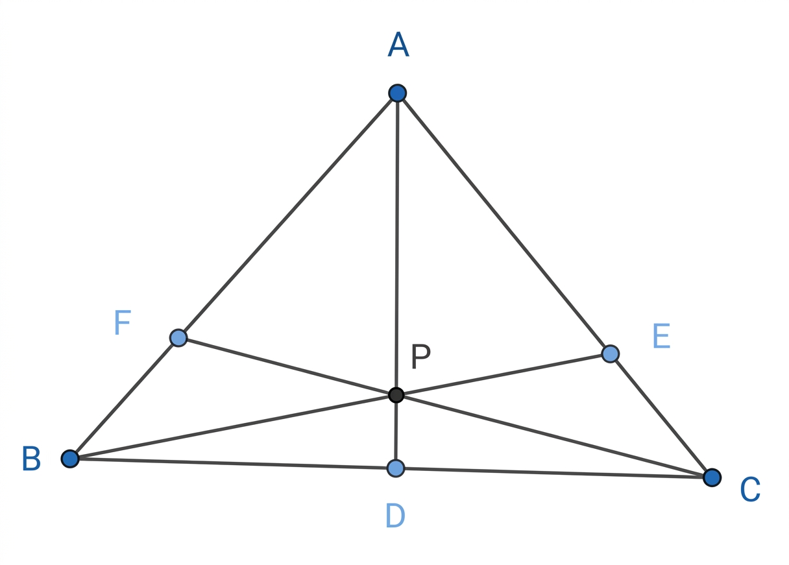

### 題目

如下圖，$\Delta ABC$ 中，$D$、$E$、$F$ 分別是 $\overline{BC}$、$\overline{AC}$ 與 $\overline{AB}$ 上的點，使得 $\overline{AD}$、$\overline{BE}$ 與 $\overline{CF}$ 交於一點 $P$，且將 $\Delta ABC$ 分割成 6 個小三角形，其中 4 個三角形 $\Delta CDP$、$\Delta BDP$、$\Delta BFP$、$\Delta AEP$ 的面積分別是 $30$、$40$、$56$、$70$，試求 $\Delta ABC$ 的面積。

### 答案

315

### 解析

設 $\Delta AFP$ 的面積為 $x$，$\Delta CEP$ 的面積為 $y$。

根據「同高三角形面積比等於底邊長比」之性質：

1. **利用底邊 $\overline{BD} : \overline{CD}$ 比值：**
   $$
   \frac{\Delta BDP}{\Delta CDP} = \frac{\Delta ABD}{\Delta ACD} = \frac{\overline{BD}}{\overline{CD}}
   $$
   代入已知的面積數據：
   $$
   \frac{40}{30} = \frac{56 + x + 40}{70 + y + 30}
   $$
   化簡後：
   $$
   \frac{4}{3} = \frac{96 + x}{100 + y} \implies 4(100 + y) = 3(96 + x) \implies 400 + 4y = 288 + 3x \implies 3x - 4y = 112 \quad \text{--- (1)}
   $$

2. **利用底邊 $\overline{AF} : \overline{BF}$ 比值：**
   $$
   \frac{\Delta AFP}{\Delta BFP} = \frac{\Delta CAF}{\Delta CBF} = \frac{\overline{AF}}{\overline{BF}}
   $$
   代入已知的面積數據：
   $$
   \frac{x}{56} = \frac{x + 70 + y}{56 + 40 + 30} = \frac{x + y + 70}{126}
   $$
   交叉相乘化簡：
   $$
   126x = 56(x + y + 70)
   $$
   兩邊同除以 $14$：
   $$
   9x = 4(x + y + 70) \implies 9x = 4x + 4y + 280 \implies 5x - 4y = 280 \quad \text{--- (2)}
   $$

3. **解方程組：**
   將 (2) 式減去 (1) 式：
   $$
   (5x - 4y) - (3x - 4y) = 280 - 112
   $$
   $$
   2x = 168 \implies x = 84
   $$
   將 $x = 84$ 代回 (1) 式求 $y$：
   $$
   3(84) - 4y = 112 \implies 252 - 4y = 112 \implies 4y = 140 \implies y = 35
   $$

4. **計算 $\Delta ABC$ 總面積：**
   $$
   \Delta ABC = \Delta AFP + \Delta BFP + \Delta BDP + \Delta CDP + \Delta CEP + \Delta AEP
   $$
   $$
   \Delta ABC = 84 + 56 + 40 + 30 + 35 + 70 = 315
   $$