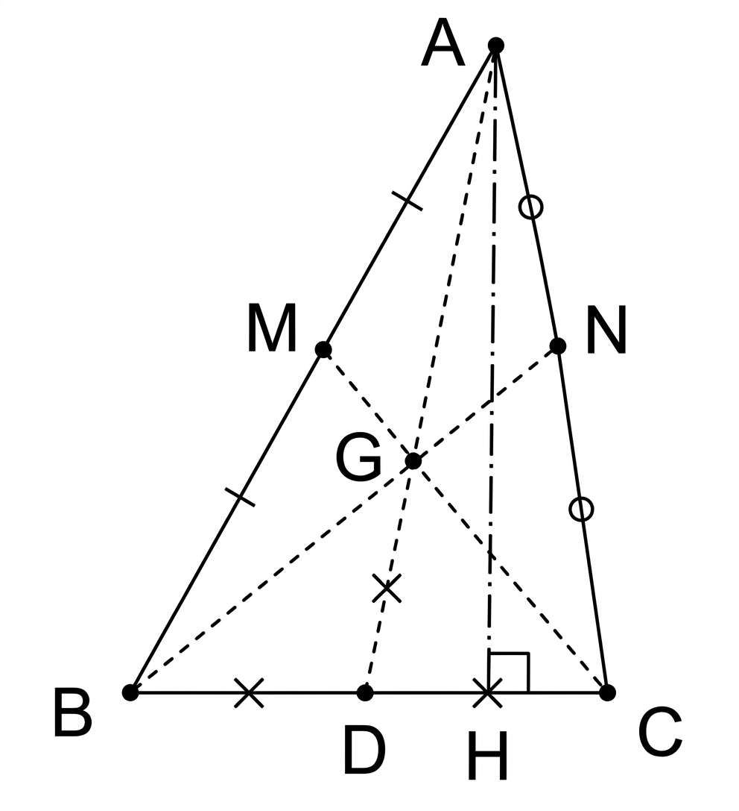

### 題目

已知 $\Delta ABC$ 是個銳角三角形，假設 $M$ 和 $N$ 分別為 $\overline{AB}$ 和 $\overline{AC}$ 之中點，且 $\overline{BN}$ 和 $\overline{CM}$ 垂直。試證明：$\cot B + \cot C \ge \frac{2}{3}$。 (114校內學科競賽)

### 答案

見解析證明。

### 解析

1. **幾何性質分析：**
   設 $\overline{BN}$ 與 $\overline{CM}$ 相交於點 $G$。因為 $M, N$ 分別為 $\overline{AB}, \overline{AC}$ 的中點，故 $G$ 為 $\Delta ABC$ 的重心，且中線 $\overline{AD}$ 必通過 $G$。
   已知 $\overline{BN} \perp \overline{CM}$，即 $\angle BGC = 90^\circ$。
   在直角 $\Delta BGC$ 中，斜邊 $\overline{BC}$ 上的中線為 $\overline{GD}$，故由直角三角形斜邊中線性質可知：
   $$
   \overline{GD} = \frac{1}{2}\overline{BC} \implies \overline{BC} = 2\overline{GD}
   $$
   又因為 $G$ 為重心，中線被重心分割比為 $\overline{AD} : \overline{GD} = 3 : 1$，故：
   $$
   \overline{AD} = 3\overline{GD}
   $$

2. **計算 $\cot B + \cot C$：**
   設 $A$ 向 $\overline{BC}$ 作高交於點 $H$（高為 $\overline{AH}$）。
   由三角函數定義：
   $$
   \cot B + \cot C = \frac{\overline{BH}}{\overline{AH}} + \frac{\overline{CH}}{\overline{AH}} = \frac{\overline{BH} + \overline{CH}}{\overline{AH}} = \frac{\overline{BC}}{\overline{AH}}
   $$

3. **不等式證明：**
   斜線段（中線 $\overline{AD}$）長度必大於或等於垂線段（高 $\overline{AH}$）長度，即 $\overline{AH} \le \overline{AD}$，故：
   $$
   \cot B + \cot C = \frac{\overline{BC}}{\overline{AH}} \ge \frac{\overline{BC}}{\overline{AD}}
   $$
   代入前面求得的 $\overline{BC} = 2\overline{GD}$ 與 $\overline{AD} = 3\overline{GD}$：
   $$
   \cot B + \cot C \ge \frac{2\overline{GD}}{3\overline{GD}} = \frac{2}{3}
   $$
   故得證 $\cot B + \cot C \ge \frac{2}{3}$。

---